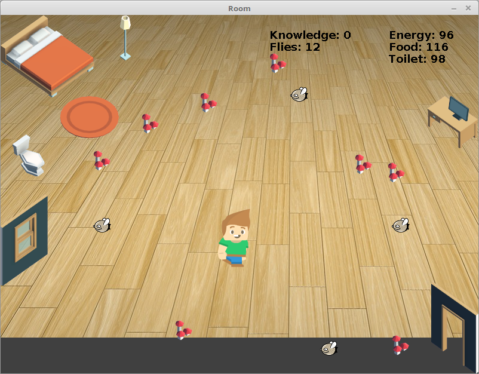

# Symulacja-studenta

Symulacja studenta. Sterowanie odbywa sie strzałkami (lewo, prawo, góra, dół). Bohater symulacji posiada wskażniki: energii, głodu, wiedzy oraz oczywiście(za tradycyjnymi simsami) - konieczności pójścia do toalety. Dodatkowo pokazany jest licznik much latających po pokoju. Wskaźniki energii, głodu i toalety obniżają się stopniowo z upływem czasu. Spadek któregokolwiek z nich poniżej zera powoduje, że student porusza się trzykrotnie wolniej. W takiej sytuacji należy położyć się do łóżka celem regeneracji. Latające po pokoju muchy przy zderzeniu ze studentem odbierają mu energię. Student żywi się grzybkami, które to poprawiają jego wskaźnik głodu, ma też dostęp do komputera, gdzie może uczyć się za pomocą fiszek, za co dostaje punkty wiedzy. 

